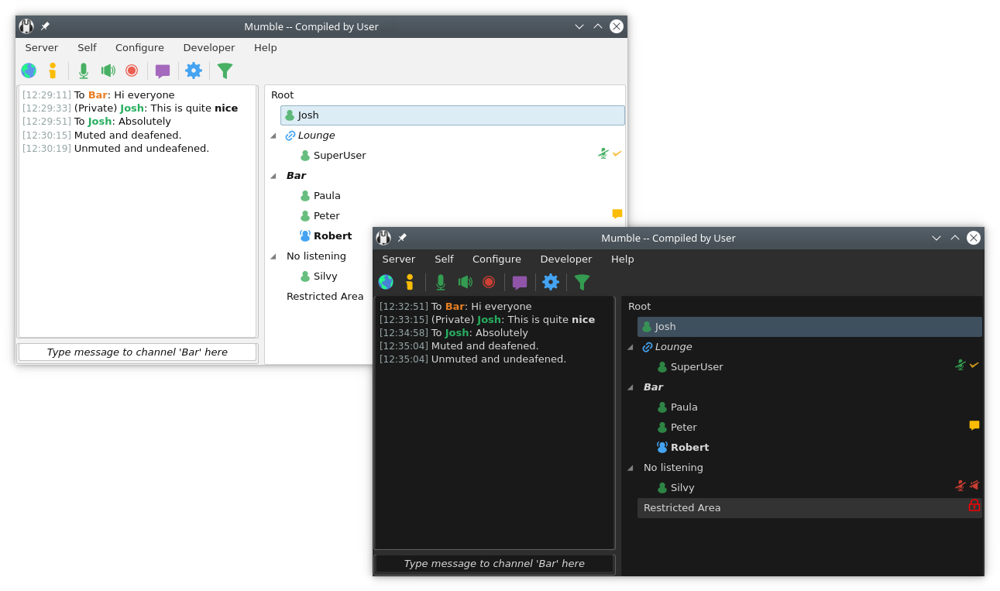

# Mumble Server pour YunoHost

[](https://dash.yunohost.org/appci/app/mumbleserver)    
[](https://install-app.yunohost.org/?app=mumbleserver)

*[Read this readme in english.](./README.md)*
*[Lire ce readme en français.](./README_fr.md)*

> *Ce package vous permet d'installer Mumble Server rapidement et simplement sur un serveur YunoHost.
Si vous n'avez pas YunoHost, regardez [ici](https://yunohost.org/#/install) pour savoir comment l'installer et en profiter.*

## Vue d'ensemble

Logiciel libre de voix sur IP (VoIP)

**Version incluse :** 1.3.0~ynh2


## Captures d'écran



## Avertissements / informations importantes

## Configuration

mumbleserver_ynh installe le paquet Debian et le configure avec les paramètres donnés. Le mot de passe et d'autres informations utiles sont envoyés après l'installation.

- [Ajouter l'administrateur](http://wiki.mumble.info/wiki/Murmurguide#Connecting_to_Murmur_Server)

## Documentations et ressources

* Site officiel de l'app : https://mumble.info
* Documentation officielle de l'admin : https://wiki.mumble.info/wiki/Main_Page
* Dépôt de code officiel de l'app : https://github.com/mumble-voip/mumble
* Documentation YunoHost pour cette app : https://yunohost.org/app_mumbleserver
* Signaler un bug : https://github.com/YunoHost-Apps/mumbleserver_ynh/issues

## Informations pour les développeurs

Merci de faire vos pull request sur la [branche testing](https://github.com/YunoHost-Apps/mumbleserver_ynh/tree/testing).

Pour essayer la branche testing, procédez comme suit.
```
sudo yunohost app install https://github.com/YunoHost-Apps/mumbleserver_ynh/tree/testing --debug
ou
sudo yunohost app upgrade mumbleserver -u https://github.com/YunoHost-Apps/mumbleserver_ynh/tree/testing --debug
```

**Plus d'infos sur le packaging d'applications :** https://yunohost.org/packaging_apps